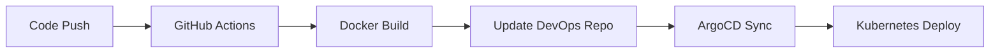

# Simple Python Flask Application

A simple Flask web application that demonstrates basic routing and template rendering functionality.

## Features

- **Endpoint Discovery**: Visit `/oshri` to see all available endpoints
- **Student Page**: Dynamic student page rendering using templates
- **Health Check**: Built-in health check endpoint
- **Docker Support**: Fully containerized with Docker

## Available Endpoints

- `GET /oshri` - Returns JSON with all available endpoints
- `GET /student/<name>` - Renders a student page with the provided name
- `GET /healthz` - Health check endpoint

## Quick Start

### Using Docker (Recommended)

1. Build the Docker image:
   ```bash
   docker build -t ghcr.io/baruchihalaish20/simple-python-app .
   ```

2. Run the container:
   ```bash
   docker run -p 5000:5000 ghcr.io/baruchihalaish20/simple-python-app
   ```

3. Access the application:
   - Open your browser and go to `http://localhost:5000`
   - Visit `http://localhost:5000/oshri` to see available endpoints
   - Try `http://localhost:5000/student/John` to see a student page

### Running Locally

1. Install dependencies:
   ```bash
   pip install -r requirements.txt
   ```

2. Run the application:
   ```bash
   python app.py
   ```

3. Access the application at `http://localhost:5000`

## Project Structure

```
simple-python/
├── app.py                 # Main Flask application
├── templates/
│   └── student.html      # Student page template
├── requirements.txt      # Python dependencies
├── Dockerfile           # Docker configuration
├── .dockerignore        # Docker ignore file
├── .github/
│   └── workflows/
│       └── update-image-tag.yml  # GitHub Actions CI/CD pipeline
├── helm/
│   └── simple-python-app/    # Helm chart for Kubernetes deployment
│       ├── Chart.yaml       # Chart metadata
│       ├── values.yaml      # Default configuration values
│       ├── templates/       # Kubernetes manifests
│       │   ├── deployment.yaml
│       │   ├── service.yaml
│       │   ├── ingress.yaml
│       │   ├── configmap.yaml
│       │   ├── serviceaccount.yaml
│       │   ├── hpa.yaml
│       │   └── _helpers.tpl
│       └── README.md        # Helm chart documentation
└── README.md           # This file
```

## Dependencies

- Flask: Web framework for Python

## Development

The application runs in debug mode by default when started locally. It's configured to:
- Listen on all interfaces (`0.0.0.0`)
- Use port 5000
- Enable debug mode for development

## Docker

The application is containerized and ready for deployment. The Dockerfile:
- Uses Python 3.11 slim base image
- Installs dependencies from requirements.txt
- Exposes port 5000
- Runs the Flask application

## GitHub Actions & GitOps

The application includes automated CI/CD pipeline using GitHub Actions and ArgoCD for GitOps deployment.

### Automated Workflow

1. **Code Push** → Triggers GitHub Actions workflow
2. **Docker Build** → Builds and pushes image with commit SHA1 tag
3. **Update DevOps Repo** → Updates image tags in DevOps repository
4. **ArgoCD Sync** → Automatically deploys to Kubernetes environments

### Workflow Triggers

The GitHub Actions workflow triggers on:
- Push to `main` or `cursor` branches
- Changes to: `app.py`, `requirements.txt`, `Dockerfile`, `templates/`
- Manual workflow dispatch with environment selection

### Environment Management

- **Development**: Auto-deploy on any push
- **Staging**: Auto-deploy on push to main branch
- **Production**: Manual approval required

### Manual Deployment

You can manually trigger deployment for specific environments:

```bash
# Via GitHub Actions UI
# Go to Actions → Update Image Tag → Run workflow
# Select environment: dev, staging, or prod
# Optionally specify custom image tag
```

### GitHub Secrets Setup

The workflow requires the following GitHub secrets to be configured:

#### Required Secrets

1. **GITHUB_TOKEN** (Automatically provided)
   - GitHub automatically provides this token
   - No manual setup required
   - Used for building and pushing Docker images

2. **DEVOPS_REPO_TOKEN** (Required for cross-repo updates)
   - Personal Access Token (PAT) with `repo` scope
   - Required to push image tag updates to the DevOps repository
   - See setup instructions below

3. **ARGOCD_TOKEN** (Optional)
   - For triggering ArgoCD sync via API
   - Get from ArgoCD UI: User Settings → Account → Tokens
   - Add to repository secrets if you want automatic ArgoCD sync

#### Setting Up Secrets

1. **Create a Personal Access Token (PAT)**:
   - Go to GitHub → **Settings** → **Developer settings** → **Personal access tokens** → **Tokens (classic)**
   - Click **Generate new token** → **Generate new token (classic)**
   - Set a descriptive name: `DevOps Repo Access for CI/CD`
   - Select scopes:
     - ✅ `repo` (Full control of private repositories)
   - Click **Generate token**
   - **Copy the token immediately** (you won't see it again!)

2. **Add Token to Repository Secrets**:
   - Navigate to your `simple-python-app` repository
   - Click **Settings** → **Secrets and variables** → **Actions**
   - Click **New repository secret**
   - Add:
     ```
     Name: DEVOPS_REPO_TOKEN
     Value: <paste-your-PAT-here>
     ```

3. **Optional: Add ArgoCD Token**:
   ```
   Name: ARGOCD_TOKEN
   Value: <your-argocd-api-token>
   ```

4. **Verify Secrets**:
   - Go to **Actions** → **Update Image Tag** → **Run workflow**
   - Check that secrets are available in the workflow

#### Getting ArgoCD Token (Optional)

```bash
# Access ArgoCD UI
kubectl port-forward svc/argocd-server -n argocd 8080:443

# Login to ArgoCD
argocd login localhost:80

# Create API token
argocd account generate-token --account <username>
```

#### Workflow Permissions

Ensure the workflow has the necessary permissions:

```yaml
# In .github/workflows/update-image-tag.yml
permissions:
  contents: read
  packages: write
  id-token: write
```

#### Troubleshooting GitHub Actions

**Common Issues:**

1. **Permission Denied Errors**:
   - Ensure `GITHUB_TOKEN` has proper permissions
   - Check repository settings for Actions permissions

2. **Docker Push Failures**:
   - Verify GitHub Container Registry access (uses GITHUB_TOKEN)
   - Ensure `packages: write` permission is set in workflow
   - Check if image name conflicts exist

3. **DevOps Repository Access** (`Permission denied to github-actions[bot]`):
   - This means `DEVOPS_REPO_TOKEN` is not set or is invalid
   - Create a Personal Access Token with `repo` scope
   - Add it as `DEVOPS_REPO_TOKEN` in repository secrets
   - Ensure the token has access to both repositories

4. **ArgoCD Sync Not Working**:
   - Check if `ARGOCD_TOKEN` is properly set
   - Verify ArgoCD server URL and token validity

**Debug Steps:**

```bash
# Check workflow logs
# Go to Actions → Update Image Tag → Click on failed run

# Test repository access
curl -H "Authorization: token $GITHUB_TOKEN" \
  https://api.github.com/repos/BaruchiHalamish20/simple-python-app-devops

# Verify ArgoCD connectivity
curl -H "Authorization: Bearer $ARGOCD_TOKEN" \
  https://your-argocd-server.com/api/v1/applications
```

## Kubernetes Deployment with Helm

The application includes a complete Helm chart for deploying to Kubernetes clusters.

### Prerequisites

- Kubernetes cluster (1.19+)
- Helm 3.2.0+
- kubectl configured to access your cluster

### Quick Deploy to Kubernetes

1. **Build and push your Docker image**:
   ```bash
   # Build the image
   docker build -t ghcr.io/your-username/simple-python-app:latest .
   
   # Push to GitHub Container Registry
   docker push ghcr.io/your-username/simple-python-app:latest
   ```

2. **Deploy using Helm**:
   ```bash
   # Create namespace (optional)
   kubectl create namespace simple-python
   
   # Deploy the application
   helm install my-simple-app ./helm/simple-python-app \
     --namespace simple-python \
     --set image.repository=ghcr.io/your-username/simple-python-app \
     --set image.tag=latest
   ```

3. **Access the application**:
   ```bash
   # Port forward to access locally
   kubectl port-forward svc/my-simple-app 8080:80 -n simple-python
   
   # Or expose via LoadBalancer
   kubectl patch svc my-simple-app -n simple-python -p '{"spec":{"type":"LoadBalancer"}}'
   ```

### Production Deployment

For production, use additional configuration:

```bash
helm install my-simple-app ./helm/simple-python-app \
  --namespace simple-python \
  --set image.repository=ghcr.io/your-username/simple-python-app \
  --set replicaCount=3 \
  --set resources.limits.cpu=1000m \
  --set resources.limits.memory=1Gi \
  --set ingress.enabled=true \
  --set ingress.hosts[0].host=api.yourcompany.com \
  --set autoscaling.enabled=true \
  --set autoscaling.minReplicas=2 \
  --set autoscaling.maxReplicas=10
```

### Helm Chart Features

- **Deployment**: Configurable replica count and resource limits
- **Service**: ClusterIP service with configurable ports
- **Ingress**: Optional ingress for external access
- **ConfigMap**: Environment configuration
- **ServiceAccount**: Dedicated service account
- **HPA**: Optional horizontal pod autoscaling
- **Health Checks**: Readiness and liveness probes
- **Security**: Pod security contexts and non-root user

For detailed Helm configuration options, see [helm/simple-python-app/README.md](helm/simple-python-app/README.md).

## GitOps Architecture

This application is part of a complete GitOps setup with automated CI/CD:

### Repository Structure

| Repository | Purpose | Contains |
|------------|---------|----------|
| **simple-python** | Application code | Source code, Dockerfile, GitHub Actions |
| **simple-python-app-devops** | GitOps config | ArgoCD apps, Kustomize, image tags |

### Workflow Overview



### Environment Strategy

- **Development**: Auto-deploy on any push to `cursor` branch
- **Staging**: Auto-deploy on push to `main` branch  
- **Production**: Manual approval required

### Related Repositories

- **DevOps Repository**: [simple-python-app-devops](https://github.com/BaruchiHalamish20/simple-python-app-devops)
  - Contains ArgoCD Application definitions
  - Environment-specific Kustomize overlays
  - Image tag management

## Example Usage

1. **List endpoints**:
   ```bash
   curl http://localhost:5000/oshri
   ```

2. **View student page**:
   ```bash
   curl http://localhost:5000/student/Alice
   ```

3. **Health check**:
   ```bash
   curl http://localhost:5000/healthz
   ```
